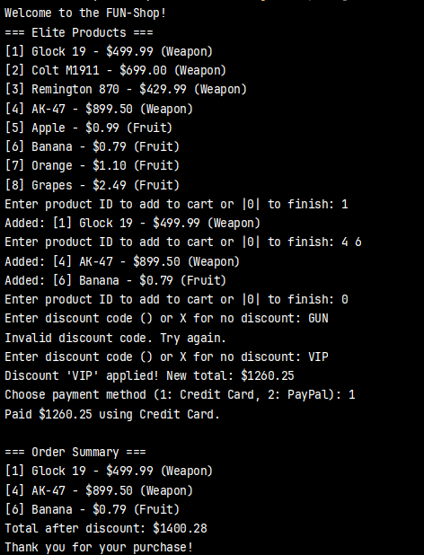

# TMPS LAB 1
Gancear Nichita, FAF-232

## Theory
The SOLID principles are a set of five fundamental object-oriented design guidelines that help make software more modular, maintainable, and extensible.
Each letter stands for one principle:
* **S - Single Responsibility Principle**

  There should never be more than one reason for a class to change. In other words, every class should have only one responsibility.

* **O - Open Closed Principle**

  Software entities should be open for extension, but closed for modification.
* **L - Liskov substitution principle**

  Subclasses should be replaceable with their base classes without breaking the program.
  This ensures that a child class behaves consistently with its parent class’s interface and expected behavior.
*  **I - Interface Segregation Principle**

   Clients should not be forced to depend on interfaces they do not use.
   It encourages smaller, more specific interfaces instead of large, general ones.
*  **D - Dependency Inversion Principle**

   High-level modules should depend on abstractions, not on concrete implementations.

## Purpose of Laboratory Work
The purpose of this laboratory work was to design and implement a simple Java project that demonstrates object oriented design following **SOLID** principles.
The goal was to apply at least three of the SOLID principles in a practical example.

## Quick Start

```powershell
# Create Program (class)
(Path to Labs) javac -d target/classes (Get-ChildItem -Path .\com\gun -Recurse -Filter *.java | ForEach-Object { $_.FullName })

```
# FUNShop Java Application

---

## SOLID Principles Applied

**Single Responsibility Principle (SRP)**  
- `Product.java` → Product data model  
- `Order.java` → Manages order items and calculates totals including discounts  
- `Discount.java` → Handles discount codes and applies discount percentages  
- `Shop.java` → Manages product catalog and lookup  
- `FUNShop.java` → Application entry point and user interaction  
- `PaymentMethod.java` → Payment interface  
- `CreditCardPayment.java`, `PayPalPayment.java` → Payment implementations

## Open/Closed Principle (OCP)
The system is designed to be easily extendable without changing existing code:

- New discount codes can be added by extending `Discount` logic  
- New payment methods can be added by implementing `PaymentMethod` interface without modifying existing code

## Dependency Inversion Principle (DIP)
- The app depends on abstractions (`PaymentMethod`) rather than concrete implementations  
- Payment classes implement the interface and can be swapped easily


## File Structure
```
src/main/java/com/gun/
├── models/
│ ├── Product.java
│ └── Order.java
├── pricing/
│ └── Discount.java
├── payment/
│ ├── PaymentMethod.java
│ ├── CreditCardPayment.java
│ └── PayPalPayment.java
├── Shop.java
└── FUNShop.java
```


## Liskov Substitution Principle (LSP)

The `Product` and `Order` classes interact seamlessly with other parts of the system. For example, the `Order` class treats all `Product` instances uniformly without needing to know their specific details beyond their price and description:

```java
Order order = new Order();
order.addProduct(new Product(1, "Glock 19", 499.99, "Weapon"));
order.addProduct(new Product(5, "Apple", 0.99, "Fruit"));

```
Here, any Product can be added to an order, and the system will correctly compute totals and display the products. This means Product objects can be substituted freely without breaking the Order class functionality, satisfying the LSP.


Interface Segregation Principle (ISP) & Dependency Inversion Principle (DIP)
The PaymentMethod interface defines a single method pay(double amount). Payment classes like CreditCardPayment and PayPalPayment implement this interface, each providing their specific payment logic:

```java
PaymentMethod payment = new CreditCardPayment();
payment.pay(100.0);

```
This design follows ISP by keeping the interface minimal and focused. DIP is demonstrated because the application depends on the
abstraction (PaymentMethod) rather than concrete implementations. This means you can add new payment types (e.g., BitcoinPayment, PaypalPayment)
without changing existing code, making the payment system flexible and easily extensible.

## Results
In this program, you first see a list of available products, including weapons and fruits, each with a price and category.
You can add items to your cart by entering their product IDs and finish your selection by entering 0.
Next, you’re prompted to enter a discount code, which you can skip or try multiple times until a valid code is entered, applying the discount to your total.

After that, you choose a payment method such as Credit Card or PayPal. Finally, the program shows a summary of your order with the discounted total and confirms your payment method and amount paid.
The process is smooth, modular, and easy to extend thanks to solid design principles.



